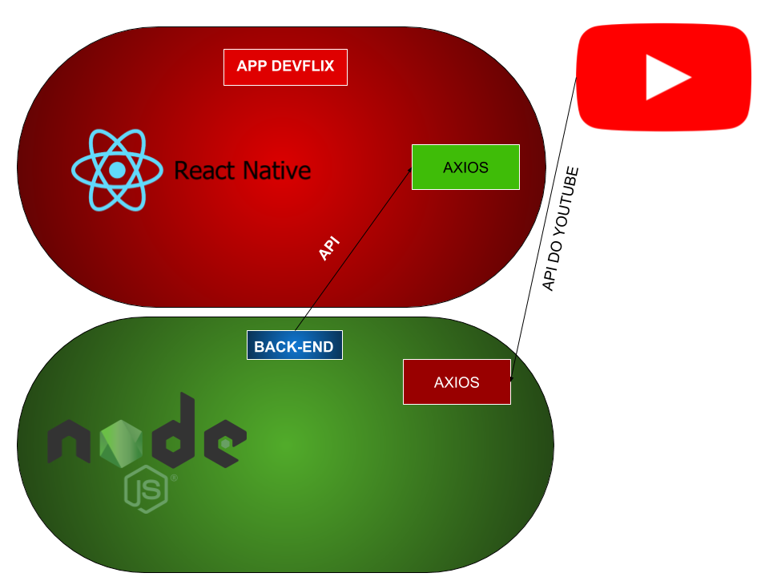

# DevFlixJ
- App para reprodução de vídeos -  Estilo Netflix

🎯**Objetivo**

- Criar um app com funcionalidade de streaming de vídeos sobre programação através de um API. 

✒️**Justificativa**

- Em prol do aprendizado na matéria Desenvolvimento de Sistemas para Dispositivos Móveis do curso de Desenvolvimento de Sistemas do SENAI.

**APIs**

- [YouTube](https://www.googleapis.com/youtube/v3)

👨🏼‍💻**Autores**

Foto | Nome | GitHub | Likedin | E-mail
---- | ---- | ------ | ------- | ------
 | Júlio Cézar Filho | [juliofilhodeveloper](https://github.com/juliofilhodeveloper) | [Linkedin](https://www.linkedin.com/in/j%C3%BAlio-c%C3%A9zar-filho-66294719a/) | contatojotaj@gmail.com

💻**Tecnologias**

- React Native
- Java Script

Frameworks:

- Axios;
- Expo;
- npm;
- react-navigation.

**Arquitetura**
Arquitetura - DevFlix

👷**Comandos**

✔️* Instalar o Expo-cli:

`npm install -g expo-cli`

✔️* Inicializar uma aplicação

`expo init name_project`

✔️* Instalar dependências

`npm install`

✔️* Start na aplicação

`npm start`

🤝**Contribuição**

Confira a [contributing](https://github.com/jeffeloy/devflix/blob/master/CONTRIBUTING.md) página para ver os melhores locais para arquivar problemas, iniciar discussões e começar a contribuir.

📄**Licença**

Lançado em 2020.
Este projeto está sob a [License](https://github.com/jeffeloy/devflix/blob/master/LICENSE).
